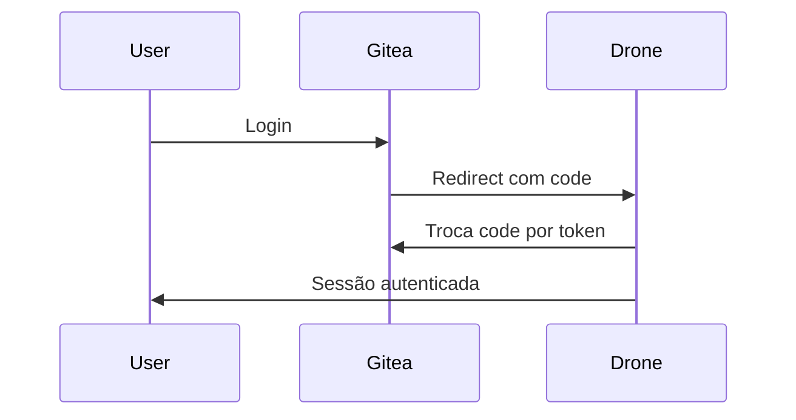
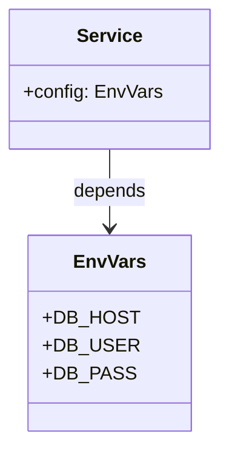

# DevOps Stack - Architecture Decision Records (ADR)


## Documento de Decisões de Arquitetura

## ADR 001: Escolha do Docker Compose para Orquestração
### Status
✅ Aceito

### Contexto
Necessidade de orquestrar múltiplos serviços interdependentes em ambiente de desenvolvimento/teste com baixa complexidade operacional.

### Decisão
Utilizar Docker Compose como ferramenta principal de orquestração.

### Consequências
- ✔️ Fácil configuração e inicialização
- ✔️ Versionamento da infraestrutura como código
- ✔️ Suporte nativo a redes definidas pelo usuário
- ❌ Limitações em ambientes de produção escaláveis
- ❌ Ausência de recursos avançados de clustering

---

## ADR 002: Padrão de Rede Bridge Personalizada
### Status
✅ Aceito

### Contexto
Requisitos de comunicação entre containers com:
- Isolamento de rede
- Controle de sub-rede específica
- Resolução de nomes personalizada

### Decisão
Implementar rede bridge personalizada com configuração IPAM:
```yaml
networks:
  devops-network:
    driver: bridge
    ipam:
      config:
        - subnet: 172.20.0.0/16
```

### Consequências
- ✔️ Comunicação isolada entre serviços
- ✔️ Controle preciso de faixa de IPs
- ✔️ Resolução de nomes via Docker DNS
- ❌ Configuração adicional para hosts externos

---

## ADR 003: Banco de Dados Centralizado
### Status
✅ Aceito

### Contexto
Múltiplos serviços (Gitea, Drone, SonarQube) necessitando de persistência de dados com requisitos similares.

### Decisão
Utilizar instância única do PostgreSQL com:
- Bancos de dados separados por serviço
- Usuários dedicados para cada serviço
- Script de inicialização unificado

### Consequências
- ✔️ Otimização de recursos
- ✔️ Gerenciamento centralizado
- ✔️ Backup simplificado
- ❌ Ponto único de falha
- ❌ Possível gargalo de desempenho

---

## ADR 004: Autenticação OAuth entre Gitea e Drone
### Status
✅ Aceito

### Contexto
Necessidade de integração segura entre o Gitea (Git server) e Drone (CI/CD) para autenticação de usuários.

### Decisão
Implementar fluxo OAuth 2.0:


### Consequências
- ✔️ SSO (Single Sign-On)
- ✔️ Gerenciamento centralizado de permissões
- ✔️ Experiência de usuário unificada
- ❌ Configuração inicial complexa

---

## ADR 005: Uso de Runners SSH
### Status
✅ Aceito

### Contexto
Requisitos para execução de pipelines em ambiente dedicado com ferramentas específicas pré-instaladas.

### Decisão
Adotar Drone Runner SSH com:
- Comunicação segura via chaves SSH
- Runner dedicado para builds
- Labels para seleção específica

### Consequências
- ✔️ Ambiente de build isolado e controlado
- ✔️ Flexibilidade na escolha de ferramentas
- ✔️ Compatibilidade com pipelines complexos
- ❌ Gerenciamento adicional de chaves SSH
- ❌ Overhead de conexão SSH

---

## ADR 006: Implementação de Health Checks
### Status
✅ Aceito

### Contexto
Necessidade de garantir a saúde dos serviços e dependências antes de aceitar conexões.

### Decisão
Implementar health checks em todos os serviços principais:
```yaml
healthcheck:
  test: ["CMD", "curl", "-f", "http://localhost:3000/"]
  interval: 30s
  timeout: 10s
  retries: 3
  start_period: 40s
```

### Consequências
- ✔️ Inicialização ordenada de serviços
- ✔️ Autorrecuperação de containers
- ✔️ Melhoria na resiliência do sistema
- ❌ Configuração adicional por serviço

---

## ADR 007: Estratégia de Configuração via Environment
### Status
✅ Aceito

### Contexto
Necessidade de parametrizar a stack para diferentes ambientes sem alterar código.

### Decisão
Centralizar configurações em arquivo `.env` com:
- Variáveis para todos os serviços
- Geração automática de secrets
- Separação clara por seções

### Consequências
- ✔️ Configuração desacoplada do código
- ✔️ Fácil adaptação para diferentes ambientes
- ✔️ Segurança através de secrets
- ❌ Risco de vazamento de credenciais
- ❌ Gerenciamento manual de arquivos .env

---

## ADR 008: Proxy Reverso com Nginx
### Status
✅ Aceito

### Contexto
Expor múltiplos serviços na mesma porta (80/443) com nomes de domínio diferentes.

### Decisão
Implementar Nginx como proxy reverso com:
- Configuração baseada em hostnames virtuais
- Terminação SSL centralizada
- Gerenciamento de tráfego unificado

```nginx
server {
    server_name gitea.local;
    location / {
        proxy_pass http://gitea:3000;
    }
}
```

### Consequências
- ✔️ Ponto único de entrada
- ✔️ Gerenciamento centralizado de certificados
- ✔️ Possibilidade de load balancing futuro
- ❌ Ponto único de falha
- ❌ Configuração adicional complexa

---

## ADR 009: Estratégia de Volumes Persistentes
### Status
✅ Aceito

### Contexto
Necessidade de persistência de dados entre reinicializações de containers.

### Decisão
Implementar estratégia mista de volumes:
```yaml
volumes:
  - ./data/gitea:/data  # Bind mount
  - build_cache         # Volume nomeado
```

### Consequências
- ✔️ Persistência de dados críticos
- ✔️ Backup simplificado via bind mounts
- ✔️ Desempenho melhorado com volumes nomeados
- ❌ Gerenciamento de permissões complexo
- ❌ Consumo de espaço em disco

---

## ADR 010: Build Server Personalizado
### Status
✅ Aceito

### Contexto
Requisitos específicos para ambiente de builds:
- Versão específica do Node.js
- Ferramentas de análise estática
- Ambiente Linux/ARM64

### Decisão
Criar Dockerfile personalizado:
```dockerfile
FROM --platform=linux/arm64 ubuntu:jammy
RUN apt-get update && apt-get install -y \
    openssh-server nodejs python3-pip sonar-scanner
```

### Consequências
- ✔️ Ambiente de build totalmente controlado
- ✔️ Otimizado para arquitetura ARM64
- ✔️ Controle preciso de versões de ferramentas
- ❌ Manutenção adicional da imagem customizada
- ❌ Aumento no tempo de build inicial
```

## Padrões de Projeto Implementados

### 1. Repository Pattern (PostgreSQL)
- **Implementação**: Banco centralizado com schemas isolados por serviço
- **Benefícios**: 
  - Reutilização de recursos
  - Consistência nas operações de backup
  - Controle centralizado de acesso

### 2. Dependency Injection (Variáveis de Ambiente)


### 3. Proxy Pattern (Nginx)
- Atua como intermediário para todos os serviços web
- Implementa interface única para múltiplos backends

### 4. Health Check Pattern
- Monitoramento contínuo da saúde dos serviços
- Recuperação automática através do sistema de orquestração

### 5. Builder Pattern (Dockerfile customizado)
- Construção gradual do ambiente de build
- Isolamento de etapas de configuração

## Decisões Futuras Consideradas

| Decisão                          | Status     | Prazo       | Motivação                     |
|----------------------------------|------------|-------------|-------------------------------|
| Migração para Kubernetes         | ⏳ Pendente | Q4 2025     | Escalabilidade horizontal     |
| Implementação de Vault           | ⏳ Pendente | Q1 2026     | Gerenciamento avançado de secrets |
| Adoção de Traefik                | ❌ Rejeitada | -           | Complexidade vs Benefícios    |
| Cluster PostgreSQL               | ⏳ Pendente | Q3 2025     | Alta disponibilidade          |
| Service Mesh (Linkerd/Consul)    | 🔍 Em estudo | Indefinido  | Observabilidade avançada      |

> **Nota de Manutenção**: Decisões devem ser revisadas trimestralmente para garantir alinhamento com objetivos de negócio e evolução tecnológica