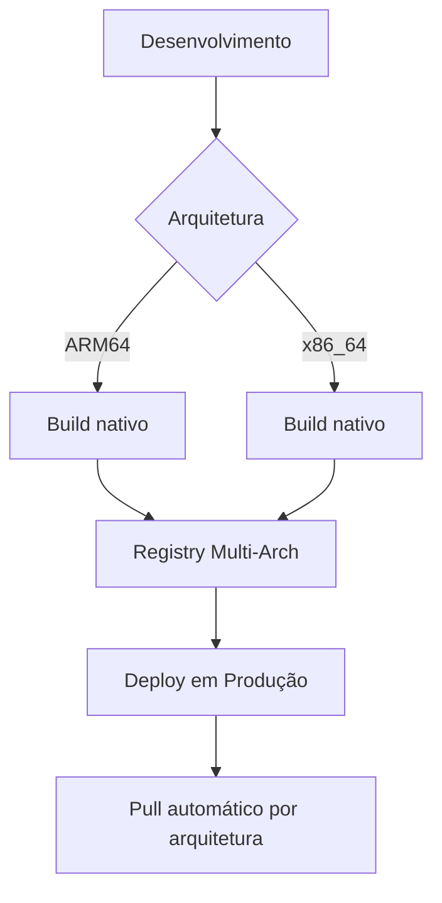

# Documentação: Compatibilidade Multi-Arquitetura (ARM64 e x86_64)

## Guia de Compatibilidade Multi-Arquitetura

## Para Ambientes ARM64 e x86_64 (Intel/AMD)

## Sumário
1. [Visão Geral](#visão-geral)  
2. [Ajustes no Dockerfile](#ajustes-no-dockerfile)  
3. [Modificações no Docker Compose](#modificações-no-docker-compose)  
4. [Gestão de Imagens](#gestão-de-imagens)  
5. [Ajustes Específicos por Serviço](#ajustes-específicos-por-serviço)  
6. [Build Multi-Arch](#build-multi-arch)  
7. [Solução de Problemas](#solução-de-problemas)  

---

## Visão Geral
A stack deve funcionar em ambas arquiteturas:
- **ARM64** (Raspberry Pi, Apple Silicon, servidores ARM)
- **x86_64** (Intel/AMD tradicional)

Principais áreas de atenção:
1. Imagens base diferentes por arquitetura
2. Binários específicos de plataforma
3. Compatibilidade de instruções de CPU
4. Gestão de dependências

---

## Ajustes no Dockerfile
### 1. Especificação de Arquitetura
```dockerfile
# Substituir FROM fixo por arquitetura dinâmica
ARG TARGETARCH
FROM --platform=linux/${TARGETARCH} ubuntu:jammy
```

### 2. Instalação Condicional de Pacotes
```dockerfile
# Verificar arquitetura para instalações específicas
RUN if [ "$TARGETARCH" = "arm64" ]; then \
        echo "Instalando dependências ARM64"; \
        apt-get install -y libatomic1-arm64-cross; \
    else \
        echo "Instalando dependências AMD64"; \
        apt-get install -y libatomic1; \
    fi
```

### 3. Binários Específicos
```dockerfile
# Download de binários conforme arquitetura
RUN case "$TARGETARCH" in \
    "amd64") \
        SONAR_SCANNER_URL="https://binaries.sonarsource.com/Distribution/sonar-scanner-cli/sonar-scanner-cli-5.0.1.3006-linux.zip" \
        ;; \
    "arm64") \
        SONAR_SCANNER_URL="https://custom.arm64.mirror/sonar-scanner-arm64.zip" \
        ;; \
    esac && \
    wget -O scanner.zip "${SONAR_SCANNER_URL}" && \
    unzip scanner.zip -d /opt
```

---

## Modificações no Docker Compose
### 1. Build Args Dinâmicos
```yaml
services:
  build-server-node:
    build:
      context: ./infra/docker/build-server
      args:
        - TARGETARCH=${DOCKER_ARCH}
        - NODE_VERSION=18
```

### 2. Variável de Ambiente para Arquitetura
```bash
# .env - Adicionar nova variável
# Detecta arquitetura automaticamente
DOCKER_ARCH=$(docker info --format '{{.Architecture}}')
```

### 3. Platform Specification
```yaml
services:
  sonarqube:
    platform: linux/${DOCKER_ARCH}
    image: sonarqube:10.5.1-community
```

---

## Gestão de Imagens
### Imagens Oficiais com Suporte Multi-Arch
| Serviço       | Imagem                  | ARM64 | AMD64 |
|---------------|-------------------------|-------|-------|
| PostgreSQL    | postgres:16             | ✅    | ✅    |
| Nginx         | nginx:alpine            | ✅    | ✅    |
| Gitea         | gitea/gitea:1.21        | ✅    | ✅    |
| Drone         | drone/drone:2           | ✅    | ✅    |
| SonarQube     | sonarqube:community     | ⚠️*   | ✅    |

> *⚠️ SonarQube Community não tem build oficial ARM64 - usar imagem alternativa

### Imagem SonarQube Alternativa para ARM64
```yaml
sonarqube:
  image: linuxserver/sonarqube:latest  # Suporta ARM64
```

---

## Ajustes Específicos por Serviço
### 1. Build Server
**Problema Comum**: Binários de linguagens (Node.js, Python) compilados para arquitetura específica

**Solução**:
```dockerfile
# Instalação condicional do Node.js
RUN if [ "$TARGETARCH" = "arm64" ]; then \
        curl -fsSL https://deb.nodesource.com/node_18.x/pool/main/n/nodejs/nodejs_18.19.1-deb-1nodesource1_arm64.deb -o node.deb; \
    else \
        curl -fsSL https://deb.nodesource.com/node_18.x/pool/main/n/nodejs/nodejs_18.19.1-deb-1nodesource1_amd64.deb -o node.deb; \
    fi && \
    dpkg -i node.deb && \
    rm node.deb
```

### 2. SonarQube
**Problema**: Elasticsearch embutido não suporta ARM64

**Solução**:
```yaml
environment:
  - SONAR_ES_BOOTSTRAP_CHECKS_DISABLE=true  # Necessário para ARM64
  - SONAR_FORCEJAVA=true                    # Forçar Java compatível
```

### 3. PostgreSQL
**Ajuste**: Performance em ARM
```yaml
environment:
  - POSTGRES_INITDB_ARGS="--data-checksums"  # Melhor compatibilidade ARM
```

---

## Build Multi-Arch
### Estratégia para Imagens Customizadas
```bash
# Habilitar suporte multi-arch
docker buildx create --use

# Build para múltiplas arquiteturas
docker buildx build \
  --platform linux/arm64,linux/amd64 \
  -t devops-build-server:multi-arch \
  --push .  # Enviar para registry
```

### Docker Compose para Multi-Arch
```yaml
services:
  build-server-node:
    image: your-registry/devops-build-server:multi-arch
    platforms:
      - linux/arm64
      - linux/amd64
```

---

## Solução de Problemas
### Erros Comuns e Soluções

#### 1. "exec format error"
**Causa**: Binário compilado para arquitetura errada  
**Solução**:
```bash
# Verificar arquitetura da imagem
docker inspect <image> --format='{{.Architecture}}'

# Rebuild com plataforma explícita
docker build --platform linux/${DOCKER_ARCH} .
```

#### 2. "no matching manifest"
**Causa**: Imagem não disponível para arquitetura  
**Solução**:
```bash
# Verificar imagens disponíveis
docker manifest inspect imagem:tag

# Usar imagem alternativa
sed -i 's/sonarqube:community/linuxserver\/sonarqube/g' docker-compose.yml
```

#### 3. Performance Degradada em ARM
**Solução**:
```yaml
# docker-compose.yml
services:
  postgres_dbx:
    environment:
      - POSTGRES_SHARED_BUFFERS=256MB  # Ajustar para ARM
```

#### 4. Incompatibilidade de Instruções
**Solução**:
```bash
# Habilitar emulação QEMU
docker run --privileged --rm tonistiigi/binfmt --install all

# Forçar emulação para builds
docker build --platform linux/amd64 -t amd64-image .  # Em ARM
```

### Comandos de Diagnóstico
```bash
# Verificar arquitetura do host
docker info --format '{{.Architecture}}'

# Inspecionar imagem
docker image inspect --format '{{.Architecture}}' imagem:tag

# Testar emulação
docker run --rm --platform linux/amd64 amd64-alpine uname -m
```

---

## Melhores Práticas
1. **Builds Multi-Arquitetura**:
   ```bash
   docker buildx build --platform linux/arm64,linux/amd64 -t sua-imagem:multi-arch .
   ```
   
2. **Registry Centralizado**:
   - Usar Docker Hub ou registry privado para imagens multi-arch

3. **Testes em Ambientes Diferentes**:
   ```bash
   # Testar em AMD64 a partir de ARM
   docker run --platform linux/amd64 -it ubuntu uname -m
   ```

4. **CI/CD Multi-Platform**:
   ```yaml
   # Exemplo GitHub Actions
   jobs:
     build:
       runs-on: ubuntu-latest
       strategy:
         matrix:
           platform: [linux/amd64, linux/arm64]
       steps:
         - name: Build
           run: docker build --platform ${{ matrix.platform }} .
   ```

5. **Tags por Arquitetura**:
   ```bash
   docker tag sua-imagem-arm64 sua-registry/devops-stack:arm64-latest
   docker tag sua-imagem-amd64 sua-registry/devops-stack:amd64-latest
   ```

---

## Fluxo Recomendado


> **Nota Crítica**: Sempre testar em ambas arquiteturas antes de promover para produção
