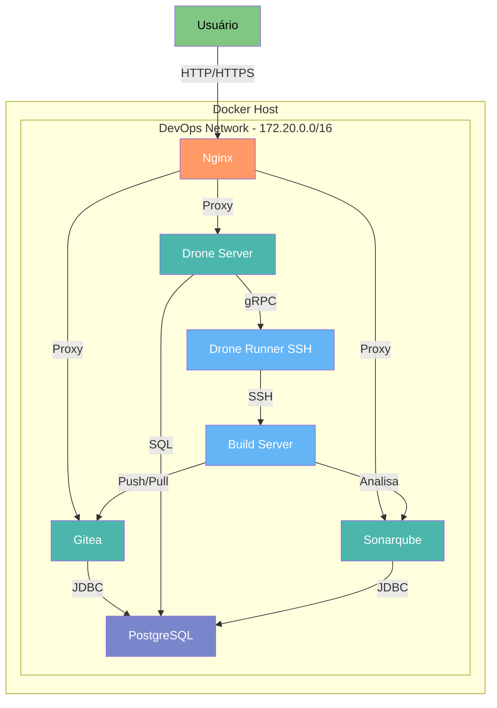
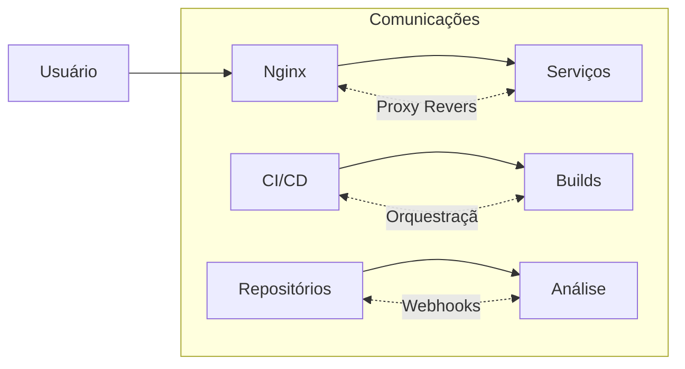
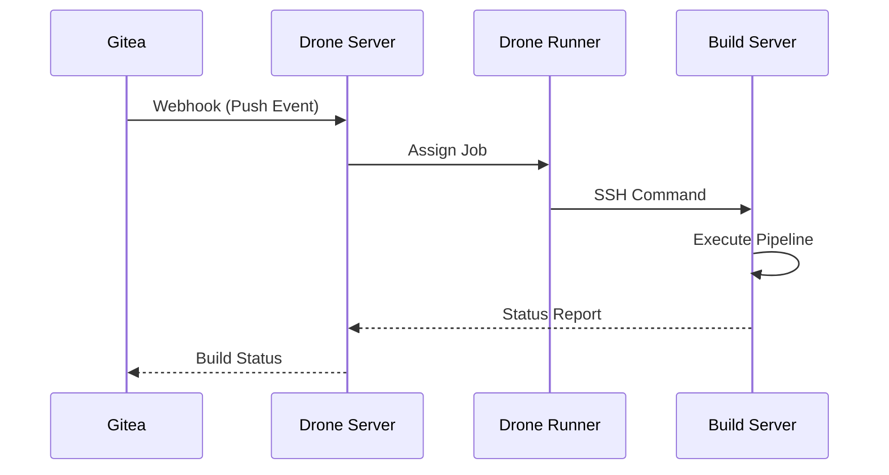

# Diagrama de Arquitetura - DevOps Stack



## Legenda do Diagrama

### Componentes Principais
1. **Nginx** (Proxy Reverso)
   - Roteamento para serviços
   - Terminação SSL
   - Balanceamento de carga

2. **Gitea** (Git Server)
   - Versionamento de código
   - Gerenciamento de repositórios
   - Integração com CI/CD

3. **Drone Server** (CI/CD Controller)
   - Orquestração de pipelines
   - Gerenciamento de builds
   - Integração com Gitea

4. **Drone Runner SSH** (CI/CD Executor)
   - Execução de jobs
   - Comunicação com Build Server
   - Escalonamento de tarefas

5. **Build Server** (Ambiente de Execução)
   - Execução de pipelines
   - Ferramentas de build (Node.js, SonarScanner)
   - Ambiente isolado

6. **SonarQube** (Análise de Qualidade)
   - Inspeção contínua de código
   - Métricas de qualidade
   - Detecção de vulnerabilidades

7. **PostgreSQL** (Banco de Dados Central)
   - Armazenamento para Gitea, Drone e SonarQube
   - Persistência de dados
   - Gerenciamento transacional

### Fluxos de Comunicação


## Padrões de Projeto Implementados

### 1. Proxy Pattern (Nginx)
- **Função**: Atuar como facade para serviços internos
- **Benefícios**:
  - Unificação de acesso
  - Segurança adicional
  - Gerenciamento centralizado de TLS

### 2. Repository Pattern (Gitea + PostgreSQL)
- **Implementação**:
  ```mermaid
  classDiagram
      class GitRepository {
          +push()
          +pull()
          +webhook()
      }
      class Database {
          +store()
          +retrieve()
      }
      GitRepository --> Database : Persists
  ```
- **Benefícios**: Separação entre armazenamento e lógica de negócios

### 3. CI/CD Pipeline Pattern


### 4. Health Check Pattern
- Implementado em todos os serviços via Docker Compose
- Exemplo:
  ```yaml
  healthcheck:
    test: ["CMD", "curl", "-f", "http://localhost:3000/"]
    interval: 30s
    timeout: 10s
    retries: 3
  ```

### 5. Dependency Injection via Environment
- Configuração centralizada no arquivo `.env`
- Injeção em tempo de execução:
  ```yaml
  environment:
    - DRONE_GITEA_SERVER=${DRONE_GITEA_SERVER}
    - DRONE_RPC_SECRET=${DRONE_RPC_SECRET}
  ```

## Considerações de Segurança

1. **Isolamento de Rede**:
   - Rede privada dedicada (devops-network)
   - Subnet específica (172.20.0.0/16)

2. **Gerenciamento de Secrets**:
   - Variáveis de ambiente sensíveis
   - Secrets gerados via OpenSSL
   - Armazenamento externo ao versionamento

3. **Controle de Acesso**:
   - SSH com chave pública
   - Permissões mínimas necessárias
   - Comunicação interna criptografada

4. **Proteção de Serviços**:
   - PostgreSQL acessível apenas internamente
   - Build Server com acesso restrito
   - Proxy reverso como único ponto de entrada público

Este diagrama e padrões seguem as melhores práticas de:
- Isolamento de componentes
- Separação de responsabilidades
- Configuração como código
- Segurança por padrão
- Observabilidade integrada