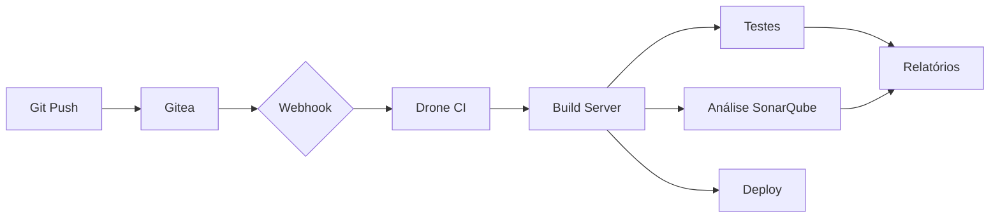
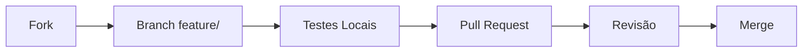

# DevOps Stack


Esta stack DevOps integra todas as ferramentas essenciais para desenvolvimento moderno, CI/CD, monitoramento e gestão de código em uma única solução containerizada com suporte para arquitetura ARM64.

## 🚀 Como Iniciar

### Pré-requisitos
- Docker 20.10+
- Docker Compose 2.0+
- Acesso root/sudo
- 4GB RAM mínimo (8GB recomendado)
- Linux (otimizado para ARM64)

### Configuração Inicial
```bash
# Clone o repositório
git clone https://github.com/seu-usuario/devops-stack.git
cd devops-stack

# Execute o setup inicial
make setup

# Configure as variáveis de ambiente
nano .env  # Edite conforme sua infraestrutura

# Configure o DNS local (Linux/Mac)
echo "127.0.0.1 gitea.local drone.local sonar.local grafana.local" | sudo tee -a /etc/hosts

# Inicie toda a stack
make up
```

### Comandos Essenciais
```bash
# Iniciar stack completa
make up

# Parar serviços
make down

# Backup completo (dados + configs)
make backup

# Verificar saúde dos serviços
make health

# Acessar logs em tempo real
make logs

# Acessar shell em um container
make shell SERVICE=sonarqube
```

## 🌐 Serviços Integrados

| Serviço               | URL                          | Porta    | Descrição                          |
|-----------------------|------------------------------|----------|------------------------------------|
| **Gitea**             | http://gitea.local           | 3000     | Git server com UI                 |
| **Drone CI**          | http://drone.local           | 80       | Pipeline CI/CD                    |
| **SonarQube**         | http://sonar.local           | 9000     | Análise de qualidade de código    |
| **Grafana**           | http://grafana.local:3001    | 3001     | Dashboard de monitoramento        |
| **Prometheus**        | http://localhost:9090        | 9090     | Coleta de métricas                |
| **Loki**              | http://localhost:3100        | 3100     | Armazenamento de logs             |
| **cAdvisor**          | http://localhost:8080        | 8080     | Monitoramento de containers       |
| **Build Server**      | http://localhost:8000        | 8000     | Ambiente de execução CI           |
| **PostgreSQL**        | postgres_dbx:5432            | 5432     | Banco de dados principal          |

**Credenciais Padrão**:  
- Gitea: `admin / senha_do_admin` (definida no .env)  
- SonarQube: `admin / admin`  
- Grafana: `$GRAFANA_ADMIN_USER / $GRAFANA_ADMIN_PASSWORD` (definidos no .env)

## 🛠 Fluxo CI/CD Integrado



### Configuração de Pipeline (.drone.yml)
```yaml
kind: pipeline
type: ssh
name: Node.js Pipeline

trigger:
  branch: [main, develop]
  event: [push, pull_request]

server:
  host: build-server-node
  user: root
  ssh_key:
    from_secret: ssh_private_key

steps:
  - name: Install Dependencies
    commands:
      - npm install

  - name: Run Tests
    commands:
      - npm test

  - name: SonarQube Analysis
    commands:
      - sonar-scanner -Dsonar.projectKey=my-project -Dsonar.host.url=http://sonar.local -Dsonar.login=${SONAR_TOKEN}

  - name: Security Scan
    commands:
      - trivy fs .
      - dependency-check --scan . --format HTML
```

## 🔍 Monitoramento e Observabilidade

### Stack Integrada:
- **Prometheus**: Coleta de métricas
- **Loki**: Armazenamento de logs
- **Grafana**: Visualização unificada
- **cAdvisor**: Métricas de containers
- **Node Exporter**: Métricas do host

### Painéis Recomendados:
1. **Visão Geral da Stack** [ID: 1860]
2. **Desempenho de Containers** [ID: 193]
3. **Análise de Logs** (Loki datasource)
4. **Métricas de CI/CD** (Drone + Build Server)


## 💾 Estratégia de Backup

### Backup Automatizado:
```bash
0 2 * * * /backup/scripts/backup-all.sh
0 3 * * * /backup/scripts/rotate-backups.sh
```

### Estrutura de Backups:
```
backup/
├── automated/
│   └── 20240520_020000/
│       ├── postgres_full_backup.sql
│       ├── volumes_backup.tar.gz
│       ├── config_backup.tar.gz
│       └── secrets_backup.tar.gz.gpg
└── manual/
    └── 20240520_120000/...
```

### Restauração Completa:
```bash
# Identifique o backup
BACKUP_DIR=./backup/automated/20240520_020000

# Execute a restauração
make restore BACKUP_DIR=$BACKUP_DIR
```

## 📁 Estrutura do Projeto

```
devops-stack/
├── backup/               # Scripts e dados de backup
├── config/               # Configurações de serviços
│   ├── nginx/            # Configuração do proxy reverso
│   ├── gitea/            # Configuração do Gitea
│   ├── drone/            # Configuração do Drone
│   └── postgres/         # Scripts de inicialização do PostgreSQL
├── data/                 # Dados persistentes
│   ├── gitea/            # Repositórios e dados do Gitea
│   ├── sonarqube/        # Dados do SonarQube
│   ├── drone/            # Dados do Drone CI
│   └── postgres/         # Dados do PostgreSQL
├── docs/                 # Documentação técnica
│   ├── architecture/     # Diagramas de arquitetura
│   └── runbooks/         # Procedimentos operacionais
├── infra/                # Definições de infraestrutura
│   └── docker/           # Dockerfiles customizados
├── monitoring/           # Configurações de monitoramento
│   ├── prometheus/       # Configuração do Prometheus
│   ├── loki/             # Configuração do Loki
│   └── grafana/          # Dashboards e provisionamento
├── scripts/              # Scripts utilitários
├── secrets/              # Dados sensíveis (não versionado)
├── tests/                # Testes automatizados
│   ├── integration/      # Testes de integração
│   └── smoke/            # Testes de fumaça
├── docker-compose.yml    # Definição de todos os serviços
├── Makefile              # Interface de operações
└── .env                  # Variáveis de ambiente (gitignored)
```

## 🔒 Segurança e Melhores Práticas

1. **Gerenciamento de Secrets**:
```bash
# Gerar novos secrets
make generate-secrets

# Atualizar .env com os novos valores
```

2. **Varredura de Segurança**:
```bash
# Verificar vulnerabilidades em containers
make security-scan

# Verificar dependências vulneráveis
docker-compose exec build-server-node dependency-check --scan /app
```

3. **Hardening de Serviços**:
- Autenticação obrigatória em todos os serviços
- Comunicação interna via rede privada Docker
- Logs sensíveis criptografados
- Atualizações automáticas de segurança via `make update`

## ⚙ Variáveis de Ambiente Críticas

| Variável               | Descrição                             | Como Gerar                    |
|------------------------|---------------------------------------|-------------------------------|
| `GITEA_SECRET_KEY`     | Chave secreta do Gitea                | `openssl rand -hex 64`        |
| `DRONE_RPC_SECRET`     | Segredo para comunicação Drone        | `openssl rand -hex 32`        |
| `POSTGRES_PASSWORD`    | Senha root do PostgreSQL              | `openssl rand -hex 16`        |
| `GITEA_OAUTH2_JWT_SECRET` | Segredo JWT para OAuth2            | `openssl rand -hex 32`        |
| `DRONE_WEBHOOK_SECRET` | Segredo para webhooks do Drone        | `openssl rand -hex 32`        |

> **Importante:** Nunca comite o arquivo `.env` no repositório!

## 🧪 Testes e Validação

### Testes de Integração:
```bash
# Executar suite de testes completa
make test

# Verificar conectividade entre serviços
docker-compose exec build-server-node curl -I http://gitea.local:3000

# Executar análise de segurança
docker-compose exec build-server-node trivy fs /app
```

### Health Checks:
```bash
# Verificar status dos serviços
make health

# Verificar logs específicos
make logs-service SERVICE=drone-server
```

## 🤝 Contribuição

1. Fluxo de trabalho:


2. Padrões:
- Commits semânticos
- Documentação atualizada
- Testes para novas funcionalidades
- Validação em ambiente ARM64

## 📄 Licença

Este projeto está licenciado sob a [MIT License](LICENSE).

---
**Manutenção**: Equipe DevOps - 2025  
**Status do Ambiente**:   
**Última Atualização**: 